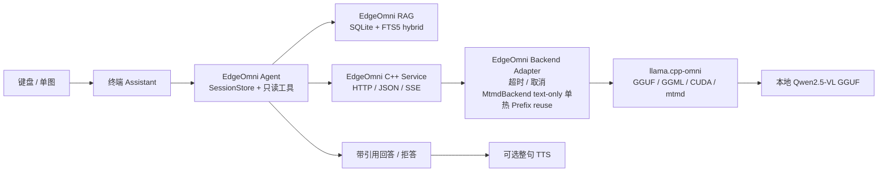

# EdgeOmni: Jetson AGX Orin 离线工业多模态知识助手

> 面向端侧部署作品集的 C++ LLM/VLM Runtime 二次开发 + SQLite/FTS5 Hybrid RAG + 受限只读 Agent。

EdgeOmni 面向无云网络的工业设备知识问答与**单图**故障诊断：在 Jetson AGX Orin（ARM64/CUDA）上使用本地 GGUF 模型，通过 C++ HTTP/JSON/SSE Runtime 提供推理服务，并由本地 RAG、引用门禁和进程内 Agent 组织终端交互。它是可审计的离线原型，不是生产级多用户平台。

> **当前质量状态：** RAG M9.1B R2.5 为 **PARTIAL**，最终质量门未通过；text-only 单热 Token LCP Prefix reuse 已整合到实际 Qwen2.5-VL `MtmdBackend` 主路径，但 RAG/Agent 尚未向 Runtime 传递 `session_id`；Docker/systemd、鉴权、高并发和长稳压测尚未完成。

## 30 秒概览

| 招聘者关心的问题 | 仓库证据 |
| --- | --- |
| 做了什么 | 文本/单图 Runtime、HTTP/JSON/SSE、超时取消、`/ready`、`MtmdBackend` text-only 单热 KV Prefix reuse、本地 Hybrid RAG、引用/拒答门禁、受限 Agent、终端与半双工语音适配 |
| EdgeOmni 自己实现什么 | `runtime/src/` 的服务与适配层、`app/` 的检索/Agent/Assistant、离线资产合同与验证脚本；详见 [组件所有权](docs/architecture.md#组件所有权) |
| 上游提供什么 | `llama.cpp-omni` 提供 GGML/GGUF、模型加载、CUDA 后端、tokenizer/sampler、`mtmd` 等基础能力；EdgeOmni **没有**重写 CUDA kernel 或通用 KV Cache |
| 实机验证到哪里 | clean commit 已完成 Jetson Q4/Q8 配对文本和固定单图基线；另以 `de19d15` 完成离线资产 clean-clone、CUDA 全量构建、5/5 CTest、可移动 bundle 双路径审计及文本/RAG/单图 smoke |
| 怎么复核 | clone 后运行 `bash scripts/verify_public_repo.sh`；资产齐备后运行 `python3 scripts/run_local_assistant.py` |

## 架构



完整数据流、所有权和能力边界见 [架构说明](docs/architecture.md)；Runtime 请求与 sampling 合同见 [Runtime API](docs/runtime-api.md)。

## 当前基线与深入优化

`de19d15` 是 P0 clean-clone 的已验证输入提交：固定 submodule 和批准的离线资产在新路径完成 CUDA 全量构建、5/5 CTest、bundle 安装与双路径依赖审计，并通过最小 Runtime/Assistant smoke。其后的文档提交只同步该结果，不冒充重新执行过实机验证。该基线不是生产版本，也不表示 RAG 质量、VLM 准确率、长稳或深度性能优化已经完成。

实际 Qwen2.5-VL `MtmdBackend` 的 text-only Prefix Reuse 已整合到 `main`；后续工作包括 RAG/Agent 到 Runtime 的 session 映射、Nsight 驱动的 decode、VLM 多分辨率性能/质量权衡，以及 profiling 证明值得做的 RAG/HTTP 小开销。实时状态、正确性门、实验协议和整合条件见 [深入优化路线](docs/optimization-roadmap.md)。

## 已验证与待实测

| 范围 | 状态 | 可公开结论 | 证据/缺口 |
| --- | --- | --- | --- |
| Python 编排、RAG/Agent 合同 | 已验证 | 本仓库模型无关测试可运行 | `tests/`；统一验证入口 |
| C++ FakeBackend/Runtime 合同 | **已验证** | `de19d15` clean-clone 的 Jetson 主机环境中 5/5 CTest passed、0 failed、0 skipped | `runtime/tests/`；受限沙箱仍可能 skip，必须与本机结果分开披露 |
| 可移动离线 bundle | **已验证** | 新路径完成 CUDA build/install；56 个 canonical ELF、14 个 symlink 通过 manifest、严格相对 RPATH、清空 `LD_LIBRARY_PATH` 的 `ldd` 和第二路径 relocation 审计 | [Jetson 验证摘要](docs/jetson-validation.md)；模型与生成资产不随 Git 分发 |
| Jetson CUDA 构建/offload | 已有冻结记录 | Jetson AGX Orin 上记录 37/37 layer offload | [Jetson 验证摘要](docs/jetson-validation.md)；完整公开日志待补 |
| Q4_K_M 文本基线 | **已验证** | MODE_30W 锁频，1 次预热 + 15 次请求；TTFT median 112 ms，decode median 15.098 token/s | [reviewed Q4 报告](benchmarks/q4-k-m-locked-20260812.md)；短时单请求结果，不是生产 SLA |
| Q4_K_M / Q8_0 配对 | **已验证** | 同一 clean commit、锁频协议下 decode median 为 15.101 / 15.227 token/s；统一 RAM median 为 12,458 / 13,928 MB | [配对报告](benchmarks/q4-q8-paired-20260812.md)；速度近似持平，Q4 以资源效率作为部署优先候选 |
| Q4_K_M / Q8_0 固定单图 | **已验证 E2E + 阶段计时** | clean commit 分阶段重测：vision encode median 305 / 277 ms，embedding 注入 31 / 28 ms；Runtime total 1,531 / 1,463 ms | [阶段计时报告](benchmarks/q4-q8-image-stages-paired-20260813.md)；不代表准确率；`prefill_ms` 包含子阶段，不可相加 |
| RAG 质量 | **PARTIAL** | 引用与拒答门禁存在 | R2.5 最终质量门未通过，holdout 已消费且不可重跑/调参 |
| 长稳、高并发、生产鉴权 | 待实测/未实现 | 不作生产能力声明 | [限制](docs/limitations.md) |

## Clone 后立即验证

不需要模型、Jetson、麦克风或外部账号：

```bash
git clone --recurse-submodules <repository-url>
cd vlmllm-main
bash scripts/verify_public_repo.sh
```

该命令运行 Python 单元/集成测试、离线合同预检、Markdown 本地链接和仓库卫生检查；它**不**下载模型、不构建上游、不改写 RAG 索引，也不消费冻结 holdout。C++ 构建需要 [离线资产合同](docs/jetson-offline-setup.md) 中指定的 AArch64 上游构建产物。

## 资产齐备后的最短运行路径

1. 按 [Jetson 离线部署](docs/jetson-offline-setup.md) 准备固定 submodule、GGUF/MMProj、embedding 模型和只读 RAG SQLite。
2. **先进入仓库根目录**，再依次执行只读检查：

```bash
# From the repository root

python3 scripts/verify_local_assets.py --root . --config configs/assistant.json --profile contract
python3 scripts/verify_local_assets.py --root . --config configs/assistant.json --profile build-inputs
python3 scripts/verify_local_assets.py --root . --config configs/assistant.json --profile assistant
```

3. 运行统一入口：

```bash
# From the repository root
python3 scripts/run_local_assistant.py
# 可选整句 TTS；不代表麦克风/ASR 已可用
python3 scripts/run_local_assistant.py --speak
```

以上命令必须从仓库根目录执行；否则 `scripts/`、`configs/` 等仓库相对路径不会被找到。

终端使用 `/image tests/fixtures/vlm-service/synthetic-alarm-panel.png` 发起一次本地单图诊断。该路径不经过 RAG 引用校验。公开演示命令和待补截图位置见 [Demo 指南](docs/demo.md)。常见资产、ELF 架构和构建失败见 [离线部署](docs/jetson-offline-setup.md)。

## 本项目的二次开发范围

- **C++ Runtime/服务层：** 请求合同、HTTP/JSON/SSE、`/health`/`/ready`、timeout/cancel、单请求并发保护、固定容量 request-id 记录、指标输出和单图 VLM 适配。
- **推理状态管理：** `MtmdBackend` 已实现 text-only 单个 hot text session 的 Token LCP、完整 batch 边界复用、分叉/回滚与异常失效；图像请求、session 切换、timeout、cancel 和 reset 会失效。底层 KV memory/API 由 `llama.cpp-omni` 提供；这不是多用户 KV Cache，RAG/Agent 也尚未传递 Runtime `session_id`。
- **离线知识链路：** SQLite/FTS5 hybrid 检索、设备/故障码约束、无证据短路、引用保留与 citation 门禁。
- **受限应用层：** 进程内 SessionStore、最多 3 步的只读工具规划、JSONL/终端/半双工语音适配和统一启动器。
- **部署合同：** 仓库相对路径、模型大小/SHA-256、submodule commit、AArch64 ELF 和 SQLite source binding 的只读检查。

上游 `llama.cpp-omni` 的模型加载、GGUF/GGML、CUDA kernel、tokenizer/sampler 和 `mtmd` 不属于 EdgeOmni 原创实现。固定方式见 `.gitmodules`、gitlink commit 和 `configs/contracts/runtime-contract.json`；第三方许可见 [第三方声明](THIRD_PARTY_NOTICES.md)。

## 端侧 / AI 部署技术栈

| 层次 | 技术栈 | 项目中的落点 |
| --- | --- | --- |
| 目标硬件与系统 | Jetson AGX Orin、ARM64/aarch64、Ubuntu 22.04/L4T R36.4.7、CUDA 12.6、SM 87 | [离线环境基线](docs/jetson-offline-setup.md#recorded-baseline)、AArch64 ELF preflight |
| 推理底座 | `llama.cpp-omni`、GGUF/GGML、CUDA offload、`mtmd` | 固定 submodule；`runtime/CMakeLists.txt` 导入冻结 `.so`；`MtmdBackend` 调用上游 C API |
| C++ Runtime | C++17、CMake、RAII、OpenSSL EVP、threads/atomics/mutex | `runtime/src/direct_backend.cpp`、`mtmd_backend.cpp`、`vlm_asset_verifier.cpp` |
| 服务化 | `cpp-httplib`、HTTP/JSON/SSE、`/health`/`/ready`、timeout/cancel、429 busy、结构化 metrics | `runtime/src/service.cpp` 和 FakeBackend contract tests |
| 推理状态与优化 | context/batch/ubatch、GPU layers、Flash Attention、`MtmdBackend` text-only 单热 Token LCP、prefill/decode/TTFT/TPS 指标 | `RuntimeConfig`、`runtime/src/mtmd_backend.cpp`、`configs/assistant-prefix-single-hot.json`；OPT-1 已整合到 `main` |
| 本地 RAG | Python 3、SQLite/FTS5、GGUF embedding、Hybrid/RRF、设备/故障码约束、citation/refusal gate | `app/retrieval/`、`app/qa/manual_qa.py`、`configs/embedding.json` |
| 边缘应用编排 | 进程内只读 Agent、SessionStore、JSONL/终端、实验性 ASR/VAD/TTS 半双工适配 | `app/agent/`、`app/assistant/`、`app/audio/` |
| 离线交付与可观测性 | 相对路径、SHA-256/size、submodule commit、SQLite binding、`tegrastats`、模型无关 CI | `scripts/verify_local_assets.py`、`run_local_assistant.py`、[Benchmark 协议](docs/benchmark-protocol.md) |

这套技术栈体现的是“模型资产 -> C++ Runtime -> 本地服务 -> RAG/Agent -> Jetson 离线交付与测量”的部署闭环，不包含自研 CUDA kernel、TensorRT-LLM、DeepStream 或生产集群调度。

## 模型替换能力

模型路径、大小和 SHA-256 已配置化，但当前不是任意 GGUF 即插即用：

- 同一 Qwen2.5-VL 发布内的已兼容量化切换：低到中成本，需要一份新的完整 Assistant 合同和匹配 MMProj，并重新跑加载、单图与性能验证。
- 换 VLM 家族：中到高成本，固定上游必须支持其 architecture、chat template 和 `mtmd` projector，通常还需改 backend profile/适配代码。
- 换 RAG embedding：需要更新维度、pooling、模板和 fingerprint，并生成新 SQLite index；旧 R2.5 holdout 不得用于调参。

详细证据、操作清单和当前硬编码边界见 [模型替换说明](docs/model-replacement.md)。

正式 Jetson benchmark 前需执行 `sudo jetson_clocks`；`sudo jetson_clocks --show` 仅用于确认，不会锁频。采集器默认拒绝动态时钟数据进入正式对照。

## 目录

```text
runtime/       C++ Runtime、HTTP 服务、KV/VLM 合同
app/           Assistant 编排、RAG、受限 Agent、终端和音频适配器
configs/       顶层运行合同及模块专属配置
scripts/       启动、资产检查与公开仓库验证入口
benchmarks/    可公开的指标口径、空白结果模板（不含伪造数据）
knowledge/     受版本控制的合成设备手册与故障码事实
tests/         不依赖真实模型或麦克风的单元/集成测试
docs/          架构、验证、边界、Demo 和发布记录
```

当前 RAG 业务入口是 `app/retrieval/active_pipeline.py`：默认保持 R2.5 query-time gate，并使用 R2.2 SQLite index 合同。R2.6 candidate 是未进入默认路径的实验，不能据此宣称 R2.5 或 R2.6 已通过最终质量门。

## 项目边界与 Roadmap

- 单图、单请求原型；不支持视频、多图、批处理或高并发。
- `MtmdBackend` 只保留一个 hot text KV session，并按完整 batch 边界复用；图像请求、session 切换、timeout、cancel 和 reset 会失效。Agent session 仅为进程内有界状态，尚未映射为 Runtime `session_id`。
- request-id 记录只保留最近 256 个已完成请求，不是 TTL/LRU、持久化或多租户幂等服务。
- 语音为实验性半双工；外接麦克风、AEC、打断和全双工未验证。
- Docker/systemd 不是当前 P0：systemd 可作为 Jetson 运维 P1；生产鉴权、并发调度和长稳属于需重新定义 SLA 的 P1/P2。

详见 [当前限制](docs/limitations.md)、[完整作品集评审](docs/portfolio-review.md)、[深入优化路线](docs/optimization-roadmap.md)、[模型替换说明](docs/model-replacement.md)、[Roadmap](ROADMAP.md)、[发布检查清单](docs/release-checklist.md) 和 [贡献指南](CONTRIBUTING.md)。仓库代码采用 [Apache-2.0](LICENSE)；模型和第三方代码遵循各自许可证，模型权重不随仓库分发。
