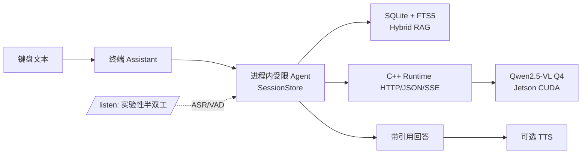

# EdgeOmni: Jetson AGX Orin 离线工业知识助手原型

> C++ LLM/VLM Runtime + Local RAG + Half-duplex Voice Prototype。

EdgeOmni 是面向 Jetson AGX Orin（ARM64/CUDA）的本地离线工业知识助手原型：键盘问题经本地 C++ Runtime、SQLite/FTS5 hybrid RAG 和受限只读 Agent 生成带引用回答，可选整句 TTS。项目基于 `llama.cpp-omni` 二次开发



## 核心技术能力

- C++ Runtime：文本与单图 VLM、HTTP/JSON/SSE、timeout/cancel、`/ready`，以及单热文本 session 的 KV Prefix reuse。
- 本地知识问答：SQLite/FTS5 向量与关键词 hybrid RAG，设备/故障码约束；无足够证据时不调用模型，回答保留引用。
- 有界 Agent：进程内 SessionStore、只读工具、citation 门禁；JSONL、终端与半双工适配器共享同一核心。
- 本地音频原型：键盘文本可选 TTS；`/listen` 仍是 ASR/VAD -> Agent -> TTS 的半双工实验路径。

## Jetson 验证摘要

已在 Jetson AGX Orin ARM64/CUDA 的冻结环境验证 Release 构建和 37/37 CUDA layer offload；Q4 与 Q8 各有 15 次有效基线测量，Q4 是部署优先候选，Q8 仅作对照。KV 仅验证单热文本 session 的 Token LCP Prefix reuse，并非生产多用户缓存。验证条件、指标口径与不应外推的范围见 [Jetson 验证摘要](docs/jetson-validation.md)。

## 最短启动

前置资产：已构建的 `build-runtime/runtime/edgeomni_vlm_service_host`、配置中声明且 SHA-256/大小匹配的本地 GGUF/MMProj、已生成的只读 RAG SQLite，以及 Python 标准库以外的可选 TTS 本地依赖。启动器不构建、不下载、不修改模型、索引或知识库。

```bash
python3 scripts/run_local_assistant.py
python3 scripts/run_local_assistant.py --speak
python3 scripts/run_local_assistant.py --config configs/assistant.json
```

启动器拒绝复用已占用的 Runtime 端口，启动 Runtime 后轮询 `/ready`，然后进入统一终端 Assistant；退出时先停止 Assistant 再停止 Runtime。传入 `--config` 时，Runtime 和 Assistant 使用同一份顶层合同。Runtime 的 CUDA/ggml 详细输出写入临时诊断日志，不污染终端；ready 前失败时会打印日志路径。`--speak` 只在首次播放时尝试 TTS，不预检麦克风、ASR、VAD 或 PortAudio；缺少可选 TTS 依赖时文本会话继续运行。`/listen` 是可选实验命令，不是默认链路前置条件。

终端可使用 `/image <仓库内相对图片路径> [可选问题]` 诊断一张本地 PNG、JPEG 或 WebP。该命令只调用本地 Runtime 的单图、非流式诊断接口；结果不经过 RAG 检索或引用校验，不表示视频、多图、批处理、并发或生产服务能力。

旧入口仍可用：`scripts/run_assistant.py` 启动已就绪 Runtime 上的终端；`run_agent.py`、`run_chat_console.py`、`run_voice_gateway.py` 保留。配置迁移说明见 [开发指南](docs/current/development-guide.md)。

## 目录

```text
runtime/       C++ Runtime、HTTP 服务、KV/VLM 合同
app/           Assistant 编排、RAG、受限 Agent、终端和音频适配器
configs/       顶层运行合同及模块专属配置
scripts/       薄启动入口
knowledge/     受版本控制的设备手册与故障码事实
tests/         不依赖真实模型或麦克风的单元/集成测试
docs/          架构、验证摘要、边界和开发记录
```

## 能力边界

- M9.1B R2.5 是 **PARTIAL**：最终 holdout 已消费，不能重跑、修改或用于调参；它不是“RAG 最终质量门已通过”。
- M10.1 仅为单热文本 session 的 KV Prefix reuse，不是多用户或生产缓存。
- M10.2 仅有界进程内 Agent/session；没有持久化、鉴权、LRU/TTL 或跨进程共享。
- M11 仅半双工。外接麦克风实测、AEC、打断、真实全双工均未完成。
- Docker/systemd、生产鉴权、高并发与长稳运行未完成；本项目不提供 Web UI。

完整限制见 [limitations](docs/limitations.md)，组件所有权见 [architecture](docs/architecture.md)。

## 测试与资产

不运行会消费 R2.5 holdout、下载模型、改写索引/知识库或要求真实麦克风的命令。常规安全检查：

```bash
python3 -m unittest discover -s tests -p 'test_*.py' -v
git diff --check
```

模型和音频资产不提交到仓库。`configs/assistant.json`、`configs/embedding.json`、`configs/voice-gateway.json` 记录仓库相对路径、来源标识、许可证、版本与 SHA-256；按这些合同离线准备资产后再启动。Qwen embedding 与语音模型的来源/许可证字段是资产准备记录，不代表仓库分发其二进制文件。
