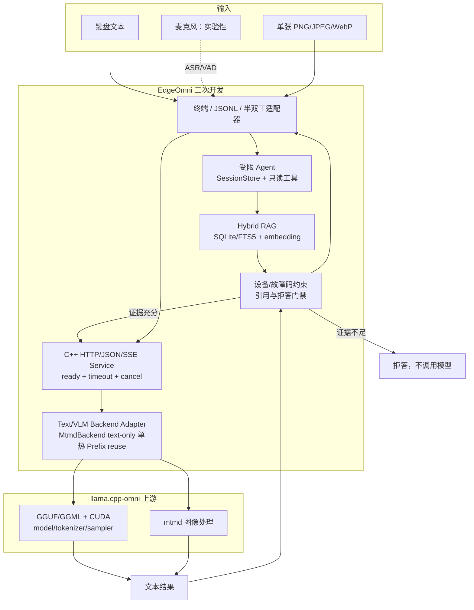
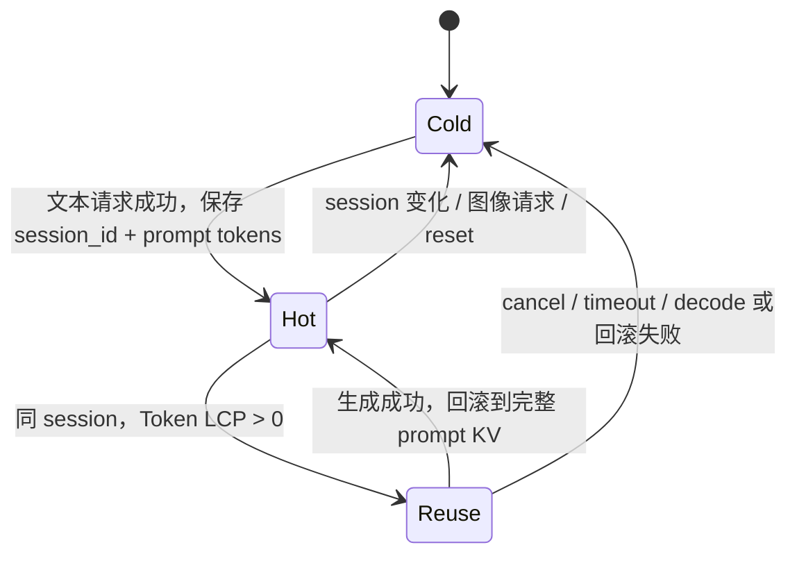
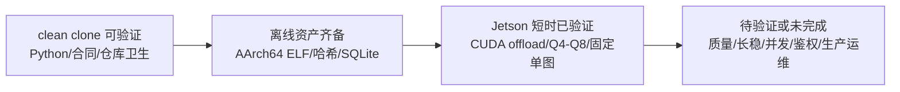

# 架构、所有权与能力边界

EdgeOmni 在 Jetson AGX Orin ARM64/CUDA 上离线运行。`runtime/` 是基于 `llama.cpp-omni` 的 C++ 二次开发层，`app/` 负责本地检索、引用、受限 Agent 与终端/音频适配。项目没有重新实现 GGML、GGUF、CUDA kernel、tokenizer/sampler、`mtmd` 或通用 KV Cache。

## 端到端数据流

文本手册问答经过 RAG 和引用门禁；`/image` 单图诊断直接进入 Runtime，不经过 RAG，因此没有引用保证。语音路径仅是半双工适配，不改变 Agent 与 Runtime 合同。

## 组件所有权

| 能力 | 提供方 | EdgeOmni 的工作 | 代码/合同证据 |
| --- | --- | --- | --- |
| GGUF/GGML、CUDA backend/kernel | `llama.cpp-omni`/其上游 | 固定 commit 和冻结 build 输入；不重写 kernel | `.gitmodules`、`configs/contracts/runtime-contract.json` |
| 模型加载、tokenizer、sampler | `llama.cpp-omni` | 配置参数、生命周期封装、错误映射 | `runtime/src/direct_backend.cpp` |
| 图像 embedding/`mtmd` | `llama.cpp-omni` | 单图输入校验、适配和 API 合同 | `runtime/src/mtmd_backend.cpp`、`vlm_input_validator.cpp` |
| HTTP/JSON/SSE、ready、取消/超时 | **EdgeOmni** | 请求校验、状态/错误、SSE 事件、单活动请求保护 | `runtime/src/service.cpp` |
| 单热 KV Prefix reuse | **EdgeOmni 对上游 KV API 的状态管理** | `MtmdBackend` 已实现 text-only Token LCP、完整 batch 边界复用、prompt KV 保留、分叉/异常失效；只保留一个 hot session | `runtime/src/mtmd_backend.cpp`、`configs/assistant-prefix-single-hot.json` |
| Hybrid RAG 与门禁 | **EdgeOmni** | SQLite/FTS5 hybrid、约束、无证据短路、引用合同 | `app/retrieval/`、`app/qa/manual_qa.py` |
| Agent/Session/适配器 | **EdgeOmni** | 有界只读工具、SessionStore、citation gate、终端/JSONL/语音适配 | `app/agent/`、`app/assistant/`、`app/audio/` |
| Qwen 模型与 embedding 权重 | 外部资产 | 记录来源、revision、大小、SHA-256；仓库不分发 | `configs/assistant.json`、`configs/embedding.json` |

“EdgeOmni 的 KV Prefix reuse”准确含义是：`MtmdBackend` 调用 `llama.cpp-omni` 的底层 KV memory/API，管理一个 text-only hot session 的 prompt token 前缀，并按完整 batch 边界复用；它不是重新实现底层 KV Cache，也不是多会话调度、分页缓存或多用户缓存。图像请求、session 切换、timeout、cancel 和 reset 会使该状态失效；RAG/Agent 当前尚未向 Runtime 传递 `session_id`。实现和实测边界见 [深入优化路线](optimization-roadmap.md)。

## 单热 KV 状态边界

该状态图描述已整合到 Qwen2.5-VL `MtmdBackend` 主路径的 text-only 单热合同。Runtime service 同时只接受一个活动请求，忙时返回 429。Agent 可保存最多 8 个逻辑 session，但这些 session 不等于 Runtime 层的多 session KV；当前 RAG 模型请求也未向 Runtime 传递 session ID。

## 配置合同

`configs/assistant.json` 是唯一顶层运行合同：

- `runtime`：127.0.0.1 endpoint、Runtime 可执行文件、GGUF/MMProj 路径与校验元数据，以及上下文参数。
- `rag.database`：唯一活动 RAG SQLite 路径。
- `modules`：模块配置位置；`agent_command`：旧 JSONL/语音入口共用的兼容命令。

模块配置不重复上述值：`manual-qa.json` 只拥有检索/embedding 配置引用与生成上限；`voice-gateway.json` 只拥有音频设备、模型和半双工参数；`embedding.json` 保留 embedding 资产和建库合同。配置路径必须为仓库相对路径，解析层拒绝绝对路径和 `..`。

`edgeomni_vlm_service_host` 接收显式 `--model`、`--mmproj`、哈希、大小和服务参数，不内置模型路径。统一启动器只读检查资产并轮询 `/ready`；Runtime 在加载时继续验证哈希。

## 验证边界

clean clone 的 CI 不能证明 Jetson CUDA、真实模型输出、功耗或性能。现有冻结实机摘要见 [Jetson 验证](jetson-validation.md)，可复现实验口径见 [Benchmark 协议](benchmark-protocol.md)。

## 模型兼容边界

Runtime 配置抽象了模型/MMProj 路径、大小、SHA-256、上下文和 offload 参数，但 `edgeomni_vlm_service_host` 当前固定创建 `MtmdBackend`，`MtmdBackend` 的资产绑定名称仍针对已审计 Qwen2.5-VL 组合。模型替换因此是“配置化已审计资产”，不是任意 GGUF 即插即用。跨量化、跨 VLM 家族和 embedding 替换的不同成本见 [模型替换说明](model-replacement.md)。

## 兼容入口

默认入口是 `python3 scripts/run_local_assistant.py`。旧 `run_assistant.py` 只连接已就绪 Runtime；`run_agent.py --config` 指向顶层 `configs/assistant.json`；`run_voice_gateway.py` 通过 `--assistant-config` 取得唯一 Agent 命令。

终端 `/image <仓库内相对图片路径> [可选问题]` 调用 `<runtime.base_url>/v1/diagnose/image`，每次仅发送一张图片和非流式 JSON。它不进入 RAG/Agent/SessionStore，不支持视频、多图、批处理、并发或生产服务语义。
