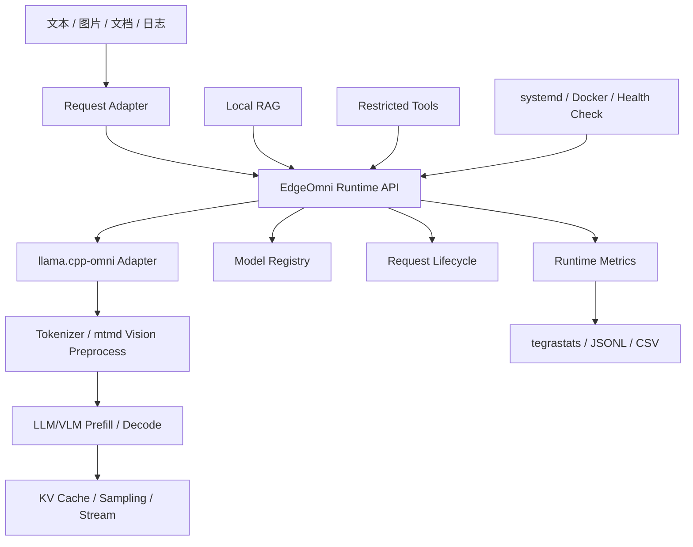

# Jetson 端侧离线多模态推理与设备故障辅助系统

## 项目交付文档

| 项目项 | 内容 |
| --- | --- |
| 项目周期 | 三个月（12 周） |
| 交付对象 | Jetson AGX Orin 32GB 端侧离线 LLM/VLM Runtime 与设备故障辅助原型 |
| 核心 Runtime | 公司基于 `llama.cpp` 开发的 `llama.cpp-omni`，本项目负责 Jetson CUDA/ARM64 适配与业务化扩展 |
| 文档状态 | 阶段性交付；已验证基线与后续交付项分开记录 |
| 目标部署 | NVIDIA Jetson AGX Orin Developer Kit，32GB 级统一内存 |

## 1. 摘要

本项目面向工业设备现场的隐私、弱网和离线约束，目标是在 Jetson AGX Orin 32GB 上形成设备知识与故障辅助能力。系统输入包括故障描述、设备照片、告警截图、本地维修手册、日志和 JSON 配置，输出故障现象摘要、原因候选、维修手册引用、分步排查建议及 Markdown/JSON 报告。

公司已在 `llama.cpp` 基础上开发 `llama.cpp-omni`，作为公司本地文本/多模态 Runtime 基础。本项目在该基础上负责 Jetson 端侧适配、运行接口封装、模型与性能评测、业务集成和部署验证：完成环境审计、CUDA Release 构建、包含依赖问题定位与修复、GGUF 模型校验、中文文本推理、CUDA offload 与资源采样。自有 C++ Runtime Adapter、量化/KV Cache 评测、VLM、RAG、受限工具和离线服务化交付仍按状态表逐项完成和验收。

## 2. 业务目标与范围

### 2.1 目标闭环

```text
故障描述 / 告警截图 / 设备照片 / 本地日志
                    ↓
        Jetson 本地 LLM/VLM Runtime
                    ↓
          本地维修手册 RAG 检索
                    ↓
   故障码查询 / 文件读取 / 日志统计等受限工具
                    ↓
      原因候选、排查步骤、引用来源和维修报告
```

### 2.2 交付范围

- Jetson ARM64/CUDA 构建与版本记录；
- GGUF LLM/VLM 模型接入、metadata、tokenizer、chat template 和 SHA-256 校验；
- 文本推理、Prefill/Decode、KV Cache、流式输出和运行指标接口设计；
- Q4_K_M/Q8_0 权重量化及 KV Cache 对比流程设计；
- 图片输入、视觉编码指标、本地维修手册 RAG、2～3 个受限工具的设计；
- systemd 或 ARM64 Docker 离线部署、健康检查、日志和恢复验证方案。

### 2.3 明确不在个人主线内

不包含 ROS2、大规模并发、通用无限权限 Agent、从零实现 GGML/CUDA kernel，以及未经实测的蒸馏、剪枝、性能或功耗结论。实时语音属于团队最终能力，只有有实际接口设计或联调记录时才计入个人贡献。

### 2.4 与公司产品的承接关系

公司已有一个面向通用主机环境的本地文本助手，采用 Ollama 形态的模型调用和应用接口。本项目不重做上层业务，而是在公司 `llama.cpp-omni` Runtime 基础上补齐 Jetson 端侧能力，并通过 Adapter 保持上层请求/响应边界稳定：

```text
公司文本助手 / 业务应用
          ↓ 既有请求与对话接口
Jetson Backend Adapter（本项目）
          ↓
公司 llama.cpp-omni Runtime
          ↓
GGUF LLM/VLM + CUDA/GGML
          ↓
本地 RAG、受限工具和故障报告
```

因此，本项目的产品交付对象不是孤立的命令行推理 Demo，而是公司已有文本助手在 Jetson 离线场景下的后端扩展。最终需以接口联调记录、端到端样例和部署包证明该承接关系。

## 3. 个人负责边界

个人职责集中在公司 `llama.cpp-omni` 基础上的 Jetson 适配、Runtime Adapter、模型和量化评测、指标链路、业务集成和部署验证。公司的 `llama.cpp-omni` 基础能力和 `llama.cpp` 上游能力均不计为本人从零实现，包括 GGUF 基础解析、GGML 计算图、CUDA kernel、原有 KV Cache、sampling、tokenizer 及 `mtmd` 基础视觉/音频编码。个人贡献应以实际提交的 CMake/构建修复、C++ 接口与生命周期管理、性能数据采集、模型配置、RAG/工具集成和部署脚本为准。

## 4. 技术架构



分层职责如下：

1. 公司 Runtime 基础层：基于 `llama.cpp` 开发的 `llama.cpp-omni`、`libllama`、`libmtmd` 和 GGML CUDA backend。
2. 本项目扩展层：模型生命周期、文本/图片生成、流式回调、取消和指标统一接口。
3. 服务层：请求校验、会话、超时、错误码和 HTTP/JSON/SSE 适配。
4. 应用层：本地 RAG、受限工具和故障报告。
5. 部署层：模型版本、日志、systemd/Docker、健康检查和恢复。

## 5. 模块交付说明

### 5.1 Jetson 环境与构建

已完成 Jetson AGX Orin、L4T、CUDA、编译器和 CMake 审计，并完成公司 `llama.cpp-omni` Release + `GGML_CUDA=ON` 的 Linux aarch64 构建。在公司 Runtime 基础上定位到 `tools/server/CMakeLists.txt` 中 `mtmd` include 目录传递问题，并提交 `PUBLIC` include 修复。

当前追溯信息：Runtime fork 为 `qingjiao-rousi/llama.cpp-omni`，branch 为 `jetson-runtime-dev`，当前修复 commit 为 `19cc26967140407efe34006a355ab445b35b16ac`（`fix(server): expose mtmd include path to cli targets`）。公司基线 commit 与本项目修复 commit 的关系仍应在交接材料中单独记录。

### 5.2 模型与版本管理

已对 Qwen2.5-3B-Instruct Q4_K_M GGUF 完成 metadata、tokenizer 和 chat template 校验，并记录本地 SHA-256。模型 registry、revision/LFS 信息和构建环境 manifest 的正式归档仍需补充。

### 5.3 文本推理基线

已完成中文文本生成冒烟，确认 `CUDA0: Orin` 可用，37/37 个可 offload 层分配到 CUDA0，并记录 CUDA model buffer、KV Cache、compute buffer 以及 tegrastats 运行采样。

### 5.4 自有 Runtime Adapter

接口边界已定义，目标包括 `initialize`、`generate_text`、`generate_with_image`、`stream_generate`、`cancel`、`reset_context`、`get_model_info`、`get_runtime_metrics` 和 `shutdown`。Backend 演进路径为 `LlamaCliBackend`（subprocess 原型）、`ServerBackend`（如目标 fork 的 HTTP server 稳定）和 `DirectBackend`（直接链接 `libllama/libmtmd`）。

现有记录未提供实现代码、单元测试或真实模型集成测试，故 Runtime Adapter 状态为“已设计，待实现/验证”。

### 5.5 VLM、RAG、工具与部署

图片输入、vision/mmproj 校验、vision encode/image token 指标、本地 PDF/Markdown/纯文本/日志 RAG、受限目录文件读取/故障码查询/日志统计工具，以及 systemd/ARM64 Docker 部署均已有接口、验收门和故障分类设计，但现有材料没有实际运行日志、样例输出、镜像 digest、服务恢复记录或引用结果，不能标记为已完成。

## 6. 已验证环境与配置

| 项目 | 实测/记录值 |
| --- | --- |
| 设备 | NVIDIA Jetson AGX Orin Developer Kit，32GB 级统一内存 |
| 系统 | Ubuntu 22.04.5 |
| L4T | R36.4.7 |
| Kernel | 5.15.148-tegra |
| CUDA Toolkit | 12.6.68 |
| GCC/G++ | 11.4.0 |
| CMake | 3.22.1 |
| Runtime 构建 | `llama-cli` Release，Linux aarch64，`GGML_CUDA=ON` |
| 模型 | Qwen2.5-3B-Instruct Q4_K_M |
| 模型 SHA-256 | `626b4a6678b86442240e33df819e00132d3ba7dddfe1cdc4fbb18e0a9615c62d` |
| GGUF | v3；`architecture=qwen2`；`file_type=MOSTLY_Q4_K_M` |
| Tokenizer | `tokens`、`merges`、chat template 已嵌入 |
| GPU | `CUDA0: Orin`；可见显存约 30GB |
| Offload | 37/37 可 offload 层分配到 CUDA0 |
| KV Cache | 4096 cells；K/V F16；CUDA0 144 MiB |

## 7. 实验结果与证据边界

### 7.1 已有单次冒烟观测

| 指标 | 结果 | 解释 |
| --- | ---: | --- |
| Prompt throughput | 170.56 tokens/s | 单次观测 |
| Decode throughput | 12.34 tokens/s | 单次观测 |

该数据仅证明当前配置下的单次运行结果，不是正式性能基线。原始 prompt、输出长度、sampling、context/batch/ubatch、warmup、功耗模式、散热条件和重复统计未在现有材料中完整给出，因此不得据此外推平均性能、P95、稳定性或功耗结论。

### 7.2 计划中的正式评测

正式 benchmark 应固定模型 revision/hash、tokenizer/chat template、prompt/输出长度、sampling、context/batch/ubatch、GPU layers、Flash Attention、KV 类型、功耗模式和散热条件；每项配置先 warmup，再至少 5 次有效重复，保存 JSONL/CSV、原始日志和 tegrastats 时间对应关系，并报告 mean、median、standard deviation，必要时报告 P95。

待补充矩阵：Q4_K_M、Q8_0、F16/BF16（实际可获得且可加载时）、KV Cache F16/Q8_0（以 Runtime 实际支持为准）、短/中/长 context、固定文本评测集和固定 VLM 图片集。

### 7.3 指标定义

TTFT 为请求进入服务到首个输出 token 可见；TPOT 为 Decode 阶段平均每输出 token 时间；`tokens/s` 分别报告 prompt 与 generation 吞吐；Total Latency 覆盖请求进入到完成或取消。墙钟总时间不得直接替代 TTFT 或 TPOT。

## 8. 业务验收指标设计

以下指标用于把“能运行的技术原型”转换为“可被业务验收的端侧产品能力”。阈值不能由技术文档自行编造，应由公司产品负责人、现场运维人员或演示目标共同确认；在阈值确认前，先完成基线采集和证据留存。

| 指标维度 | 指标定义 | 建议计算方式 | 必须留存的证据 | 阈值状态 |
| --- | --- | --- | --- | --- |
| 离线闭环 | 无外网时完成模型加载、文本/图片输入、RAG 检索和报告生成 | 固定场景断网运行；记录外联请求数 | 网络状态、服务日志、请求日志、报告文件 | 待业务确认 |
| 响应时延 | 首 token 和完整报告的可用时间 | TTFT、Total Latency 的 mean/median/P95 | request ID、时间戳、JSONL、配置 manifest | 待业务确认 |
| 故障辅助有效性 | 固定故障案例中原因、排查步骤和引用是否满足人工评分标准 | 由运维人员按 rubric 评分，报告通过率及失败类型 | 案例集、标准答案/rubric、模型输出、评分表 | 待业务确认 |
| 引用可追溯性 | 输出结论能否定位到本地文档及片段 | `有有效来源的结论数 / 需要来源的结论总数` | 文档 ID、片段 ID、输出 JSON/Markdown | 原则上不得伪造引用 |
| 工具安全性 | 工具是否只访问允许目录并可审计 | 越权访问拦截率、审计记录完整率 | Schema、权限根目录、失败日志、审计日志 | 必须 100% 拦截越权请求 |
| 工具可用性 | 受限工具能否在规定时间内返回结构化结果 | 成功率、超时率、错误分类 | 工具输入/输出、错误码、耗时 | 待业务确认 |
| 服务可靠性 | 服务能否启动、持续处理请求并在异常后恢复 | 启动成功率、连续请求失败率、恢复时间 | systemd/Docker 日志、故障注入记录、健康检查 | 待业务确认 |
| 资源约束 | 业务场景下不发生 OOM、不可接受降频或温度超限 | 峰值 RAM、GPU、温度、功耗和 OOM/降频事件 | tegrastats、功耗模式、散热条件、运行配置 | 待设备条件确认 |
| 可复现交付 | 团队成员能按固定版本重建并得到同类结果 | 构建成功率、模型 hash 一致性、结果偏差 | commit、manifest、脚本、模型 SHA-256、原始结果 | 必须可追溯 |

业务验收至少应准备三类固定数据：文本故障集、设备图片/告警截图集、本地维修手册与日志集。每个案例应记录输入、期望输出要点、允许引用来源和人工评分规则；不能只展示一条成功样例。

## 9. 十二周交付状态

| 阶段 | 计划交付 | 当前依据 | 状态 |
| --- | --- | --- | --- |
| 第1～2周 | 环境、源码、模型、CUDA 基线 | 环境审计、构建、metadata/hash、文本冒烟、offload、资源采样 | 已验证基线；可追溯性待补充 |
| 第3周 | 固定参数重复 benchmark | 目前仅有单次 prompt/decode 数据 | 待进一步实验确认 |
| 第4～6周 | C++ Runtime、流式、超时、取消、错误码 | 仅有接口与验收设计 | 已设计，待实现 |
| 第7周 | Q4/Q8、KV Cache、Prefill/Decode 报告 | 仅有 Q4 基线与 KV 观测 | 待进一步实验确认 |
| 第8～9周 | VLM 图片与视觉指标 | 未提供 VLM 运行记录 | 待实现 |
| 第10周 | 本地 RAG、受限工具、引用报告 | 已定义范围和 Schema | 待实现 |
| 第11周 | systemd/Docker、健康检查、恢复 | 未提供部署/恢复日志 | 待实现 |
| 第12周 | 演示、回归、交接 | 未提供演示记录或验收材料 | 待补充 |

## 10. 测试与验收

设计的单元测试覆盖 config、request/response、参数校验、Backend mock、超时/错误映射、metrics、工具权限和 RAG 引用格式；Jetson 集成测试覆盖 CUDA device、模型加载、offload、文本/VLM 生成、timeout/cancel、Runtime 重启、systemd/Docker 和 tegrastats；长稳测试覆盖连续请求、长上下文、内存泄漏、温度降频、OOM 恢复和异常自动重启。

现有文档未提供上述测试的命令、通过次数、失败样本或日志，因此测试验收状态不能写为已通过。

## 11. 部署设计与当前验证状态

### systemd

设计包含非 root 服务用户、配置/模型路径、启动前模型校验、异常重启、正常停止超时、journald/文件日志轮转和健康检查。尚无实际 unit 文件、启动日志或重启验证记录。

### ARM64 Docker

设计包含 Jetson 兼容镜像、模型只读挂载、GPU/设备节点映射、离线镜像导入、image digest 和宿主机/容器 CUDA 检查。尚无镜像 digest、离线导入记录或容器内验证日志。

### 模型回滚

设计包含 active/previous manifest、SHA-256 启动校验、加载失败回退和审计记录；尚无回滚演练证据。

## 12. 后续补充清单

- 公司 Runtime 基线 commit 与本项目 fork/commit 的对应关系；
- CMake 修复的 commit 说明和构建复现命令；
- 统一构建与环境 manifest；
- 每个模型的来源、revision、文件大小、SHA-256 和 GGUF metadata；
- 至少 5 次重复 benchmark 的原始 JSONL/CSV、统计结果和 tegrastats；
- Q8_0/F16 与 KV Cache 对比数据；
- VLM 模型/mmproj hash、图片集、vision 指标和输出样例；
- RAG 文档、切分/embedding/索引配置、引用结果；
- 工具 Schema、权限根目录和审计日志；
- systemd/Docker 配置、镜像 digest、健康检查、异常恢复和回滚记录；
- 单元、集成、故障注入、长稳测试的命令与日志；
- 第12周演示记录、问题清单、客户反馈与技术交接清单。

## 13. 交付结论

公司 `llama.cpp-omni` 是本项目的基础 Runtime；本项目的个人交付重点是将公司 Runtime 推进到 Jetson AGX Orin 离线场景，形成可构建、可观测、可评测、可集成和可部署的端侧 AI 后端。当前已具备 Jetson CUDA/ARM64 构建、GGUF 模型校验、中文文本推理、GPU offload 和资源采样基线；Runtime Adapter、VLM、RAG、工具和服务化能力应以实际代码、原始日志和业务验收记录完成闭环后再标记为完成。

当第 8 节业务指标和第 9～11 节技术验收均有证据支撑时，项目可对外定位为“基于公司 `llama.cpp-omni` 的 Jetson 端侧离线 LLM/VLM Runtime 与工业设备故障辅助系统”，适合用于端侧大模型、边缘生成式 AI、Jetson 部署和嵌入式 AI Runtime 方向的项目材料。
