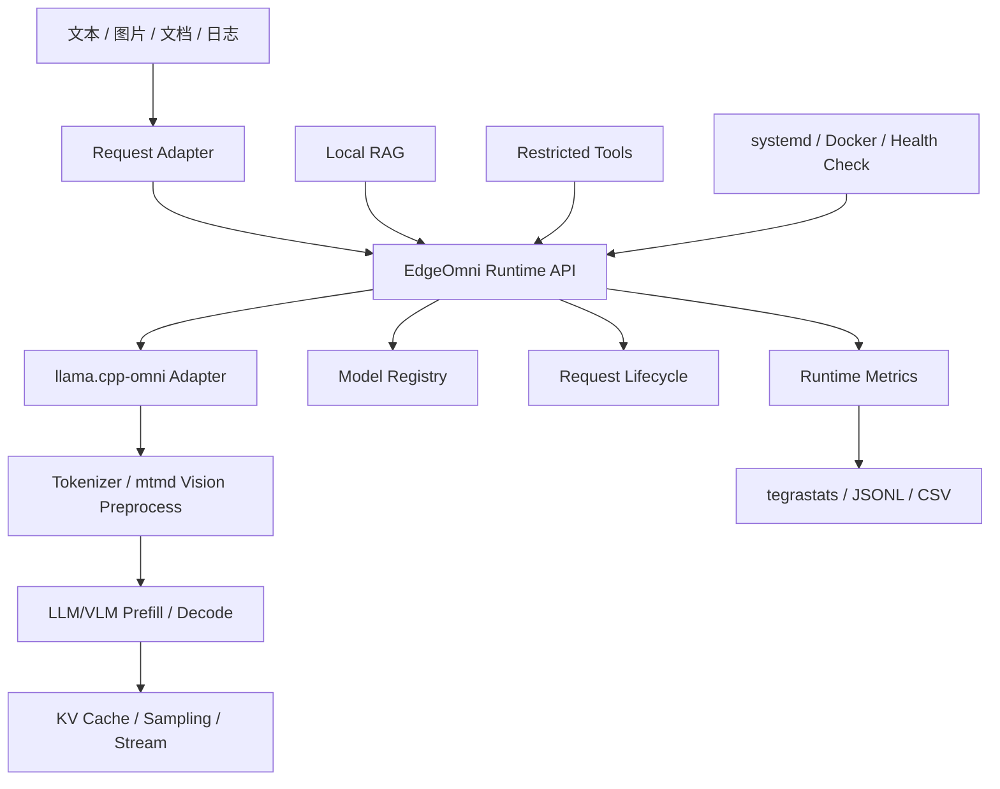

# Jetson 端侧离线多模态推理与设备故障辅助系统

## 项目交付文档

| 项目项 | 内容 |
| --- | --- |
| 项目周期 | 三个月（12 周） |
| 交付对象 | Jetson AGX Orin 32GB 端侧离线 LLM/VLM Runtime 与设备故障辅助原型 |
| 核心 Runtime | 基于 `llama.cpp` 开发的 `llama.cpp-omni`，本项目负责 Jetson CUDA/ARM64 适配与业务化扩展 |
| 文档状态 | 2026-08-06 原型收口与代码整理；M9.1B-R2.5 保持 PARTIAL，M9.2、M10.1、M10.2、M11 文本播报与 M12 终端 UI 已完成原型验证 |
| 目标部署 | NVIDIA Jetson AGX Orin Developer Kit，32GB 级统一内存 |

## 1. 摘要

本项目面向工业设备现场的隐私、弱网和离线约束，目标是在 Jetson AGX Orin 32GB 上形成设备知识与故障辅助能力。系统输入包括故障描述、设备照片、告警截图、本地维修手册、日志和 JSON 配置，输出故障现象摘要、原因候选、维修手册引用、分步排查建议及 Markdown/JSON 报告。

项目在 `llama.cpp-omni`基础上开发，本项目在该基础上负责 Jetson 端侧适配、运行接口封装、模型与性能评测和原型业务集成。已完成环境与 CUDA 构建基线、自有 C++ Runtime/HTTP-SSE 服务、Qwen3 Q4/Q8 固定评测、Qwen2.5-VL 单图 Runtime 及应用 API、M9.2 本地手册检索/citation/本地模型带来源回答闭环、M10.1 单热文本 KV Prefix 复用、M10.2 受限 Agent 与进程内多会话、M11 半双工语音网关原型及 M12 终端 UI。R2.5 的召回指标通过，但无答案拒绝率 `0.50` 未达 `0.75` 门，因此 M9.1B 保持 PARTIAL，holdout 不得重跑或用于调参。Docker/systemd、长稳、生产多用户会话和完整全双工语音未交付。最新证据化状态统一见 [项目现状总结](./总结.md)。

## 2. 业务目标与范围

### 2.1 目标闭环

```text
故障描述 / 告警截图 / 设备照片 / 本地日志
                    ↓
        Jetson 本地 LLM/VLM Runtime
                    ↓
          本地维修手册 RAG 检索
                    ↓
   故障码查询 / 文件读取 / 日志统计等受限工具
                    ↓
      原因候选、排查步骤、引用来源和维修报告
```

### 2.2 交付范围

- Jetson ARM64/CUDA 构建与版本记录；
- GGUF LLM/VLM 模型接入、metadata、tokenizer、chat template 和 SHA-256 校验；
- 文本推理、Prefill/Decode、KV Cache、流式输出和运行指标接口设计；
- Q4_K_M/Q8_0 权重量化及 KV Cache 对比流程设计；
- 图片输入、视觉编码指标、本地维修手册 RAG、2～3 个受限工具的设计；
- systemd 或 ARM64 Docker 离线部署、健康检查、日志和恢复验证方案。

### 2.3 明确不在个人主线内

大规模并发、通用无限权限 Agent、从零实现 GGML/CUDA kernel，以及未经实测的蒸馏、剪枝、性能或功耗结论。实时语音属于团队最终能力，只有有实际接口设计或联调记录时才计入个人贡献。

### 2.4 承接关系

而是在开源项目 `llama.cpp-omni` Runtime 基础上补齐 Jetson 端侧能力，并通过 Adapter 保持上层请求/响应边界稳定：

```text
文本助手 / 业务应用
          ↓ 既有请求与对话接口
Jetson Backend Adapter（本项目）
          ↓
公司 llama.cpp-omni Runtime
          ↓
GGUF LLM/VLM + CUDA/GGML
          ↓
本地 RAG、受限工具和故障报告
```

因此，本项目的产品交付对象不是孤立的命令行推理 Demo，而是已有文本助手在 Jetson 离线场景下的后端扩展。最终需以接口联调记录、端到端样例和部署包证明该承接关系。

## 4. 技术架构



分层职责如下：

1. 公司 Runtime 基础层：基于 `llama.cpp` 开发的 `llama.cpp-omni`、`libllama`、`libmtmd` 和 GGML CUDA backend。
2. 本项目扩展层：模型生命周期、文本/图片生成、流式回调、取消和指标统一接口。
3. 服务层：请求校验、会话、超时、错误码和 HTTP/JSON/SSE 适配。
4. 应用层：本地 RAG、受限工具和故障报告。
5. 部署层：模型版本、日志、systemd/Docker、健康检查和恢复。

## 5. 模块交付说明

### 5.1 Jetson 环境与构建

已完成 Jetson AGX Orin、L4T、CUDA、编译器和 CMake 审计，并完成公司 `llama.cpp-omni` Release + `GGML_CUDA=ON` 的 Linux aarch64 构建。在公司 Runtime 基础上定位到 `tools/server/CMakeLists.txt` 中 `mtmd` include 目录传递问题，并提交 `PUBLIC` include 修复。

当前追溯信息：Runtime fork 为 `qingjiao-rousi/llama.cpp-omni`，branch 为 `jetson-runtime-dev`，当前修复 commit 为 `19cc26967140407efe34006a355ab445b35b16ac`（`fix(server): expose mtmd include path to cli targets`）。公司基线 commit 与本项目修复 commit 的关系仍应在交接材料中单独记录。

### 5.2 模型与版本管理

已对文本候选和冻结模型完成 metadata、tokenizer、chat template、来源 revision、许可证、文件大小和 SHA-256 记录。Qwen3 Q4/Q8 的量化部署 manifest、Qwen2.5-VL 主模型与 mmproj 的资产/binding manifest 以及 environment/build/runtime/model manifest 均已归档。后续仍需把模型门禁从部分硬编码抽取为通用 `ModelSpec`/registry，并建立 active/previous 回滚 manifest。

### 5.3 文本推理基线

已完成中文文本生成冒烟，确认 `CUDA0: Orin` 可用，37/37 个可 offload 层分配到 CUDA0，并记录 CUDA model buffer、KV Cache、compute buffer 以及 tegrastats 运行采样。

### 5.4 自有 Runtime Adapter

接口边界已定义，目标包括 `initialize`、`generate_text`、`generate_with_image`、`stream_generate`、`cancel`、`reset_context`、`get_model_info`、`get_runtime_metrics` 和 `shutdown`。`DirectBackend` 是核心 Runtime：第一版直接链接 `libllama` 完成文本模型生命周期和生成链路，VLM 阶段再接入 `libmtmd`；HTTP/JSON/SSE 位于该接口之上。`ServerBackend` 仅在需要进程隔离或协议兼容时作为可选适配器，`llama-cli` 只用于基线和诊断，不作为业务 Backend。

当前已有 `runtime/` 下的接口与实现、FakeBackend 单元测试、HTTP/SSE loopback 契约测试和固定 Qwen3 GGUF 集成记录。文本 Runtime 阶段已完成验收，但能力边界仍是单模型、单 context、单 active request；多 session、并发队列和生产可靠性不在已验证范围内。

M10.1 已实现一个热文本 session 的 Token 级 LCP 复用、分叉回滚、最后 Prompt Token
重算、生成 KV 清理和异常失效。实机热请求命中 `17/18`、仅 Prefill 1 Token，且与冷请求
输出一致。图片 KV、VLM KV、多 session、LRU、TTL、持久化和跨进程共享均不在该原型范围。

### 5.5 VLM、RAG、工具与部署

VLM 阶段已完成固定主模型/mmproj 的 size、SHA-256、metadata binding，`ImageInput` 与图片安全门禁、`MtmdBackend`、HTTP JSON/SSE 图片链路也已有代码和测试。Jetson 上已有 4096/8192 单图、8192 合成长手册、16384 recovery、单常驻三图顺序请求以及应用 API 单图恢复冒烟记录；8192 冻结为开发默认 context。上述证据不代表并发、稳定性或生产部署。

RAG 完成 M9.1A、M9.1B 的 provider 契约、多文档、SQLite 向量/FTS5 hybrid、citation、校准/诊断/一次性最终评测和无命中门禁。R2.5 最终指标为 Recall@1/3 `0.875/0.875`、MRR `0.875`、拒绝率 `0.50`、误命中 `1`；拒答门失败，M9.1B 仍为 PARTIAL。M9.2 已把本地检索和 citation 接入本地模型生成带来源回答。M10.2 已实现三个受限只读工具、citation 门禁及有界进程内 Session；M11/M12 分别提供半双工语音网关原型和终端 UI。部署仍未完成。

## 6. 已验证环境与配置

| 项目 | 实测/记录值 |
| --- | --- |
| 设备 | NVIDIA Jetson AGX Orin Developer Kit，32GB 级统一内存 |
| 系统 | Ubuntu 22.04.5 |
| L4T | R36.4.7 |
| Kernel | 5.15.148-tegra |
| CUDA Toolkit | 12.6.68 |
| GCC/G++ | 11.4.0 |
| CMake | 3.22.1 |
| Runtime 构建 | `llama-cli` Release，Linux aarch64，`GGML_CUDA=ON` |
| 模型 | Qwen2.5-3B-Instruct Q4_K_M |
| 模型 SHA-256 | `626b4a6678b86442240e33df819e00132d3ba7dddfe1cdc4fbb18e0a9615c62d` |
| GGUF | v3；`architecture=qwen2`；`file_type=MOSTLY_Q4_K_M` |
| Tokenizer | `tokens`、`merges`、chat template 已嵌入 |
| GPU | `CUDA0: Orin`；可见显存约 30GB |
| Offload | 37/37 可 offload 层分配到 CUDA0 |
| KV Cache | 4096 cells；K/V F16；CUDA0 144 MiB |

## 7. 实验结果与证据边界

### 7.1 已有单次冒烟观测

| 指标 | 结果 | 解释 |
| --- | ---: | --- |
| Prompt throughput | 170.56 tokens/s | 单次观测 |
| Decode throughput | 12.34 tokens/s | 单次观测 |

该数据仅证明当前配置下的单次运行结果，不是正式性能基线。原始 prompt、输出长度、sampling、context/batch/ubatch、warmup、功耗模式、散热条件和重复统计未在现有材料中完整给出，因此不得据此外推平均性能、P95、稳定性或功耗结论。

### 7.2 已完成评测与剩余矩阵

Qwen3 Q4_K_M/Q8_0 已按固定 revision/hash、tokenizer/chat template、prompt/输出长度、sampling、context/batch/ubatch、GPU layers、Flash Attention、F16/F16 KV、功耗模式和散热条件完成正式重复评测。两个模型各包含 1 次 preconditioning 和 S/L/G 各 5 次有效 measured，保存 JSONL/CSV、原始日志、统计摘要和 tegrastats；Q4 冻结为部署优先候选，Q8 作为高精度对照。

剩余矩阵包括：F16/BF16（实际可获得且可加载时）、受控 Q8/Q4 KV Cache（需 DirectBackend 先公开类型配置）、更完整的真实文本质量集、VLM 重复性能/质量集、并发和长稳。M7/M8 的固定图片和 context 结果是有限冒烟，不与 M6 重复 benchmark 混为同一统计结论。

### 7.3 指标定义

TTFT 为请求进入服务到首个输出 token 可见；TPOT 为 Decode 阶段平均每输出 token 时间；`tokens/s` 分别报告 prompt 与 generation 吞吐；Total Latency 覆盖请求进入到完成或取消。墙钟总时间不得直接替代 TTFT 或 TPOT。M10.1 实施后，`prompt_tokens` 继续表示完整逻辑 Prompt，并另外报告实际 `prefill_input_tokens`、`cache_hit_tokens`、`cache_miss_tokens`、命中率、节省 Token 和失效原因，避免把逻辑上下文长度误当成本次实际 Prefill 工作量。

## 8. 业务验收指标设计

以下指标用于把“能运行的技术原型”转换为“可被业务验收的端侧产品能力”。阈值不能由技术文档自行编造，应由公司产品负责人、现场运维人员或演示目标共同确认；在阈值确认前，先完成基线采集和证据留存。

| 指标维度 | 指标定义 | 建议计算方式 | 必须留存的证据 | 阈值状态 |
| --- | --- | --- | --- | --- |
| 离线闭环 | 无外网时完成模型加载、文本/图片输入、RAG 检索和报告生成 | 固定场景断网运行；记录外联请求数 | 网络状态、服务日志、请求日志、报告文件 | 待业务确认 |
| 响应时延 | 首 token 和完整报告的可用时间 | TTFT、Total Latency 的 mean/median/P95 | request ID、时间戳、JSONL、配置 manifest | 待业务确认 |
| 故障辅助有效性 | 固定故障案例中原因、排查步骤和引用是否满足人工评分标准 | 由运维人员按 rubric 评分，报告通过率及失败类型 | 案例集、标准答案/rubric、模型输出、评分表 | 待业务确认 |
| 引用可追溯性 | 输出结论能否定位到本地文档及片段 | `有有效来源的结论数 / 需要来源的结论总数` | 文档 ID、片段 ID、输出 JSON/Markdown | 原则上不得伪造引用 |
| 工具安全性 | 工具是否只访问允许目录并可审计 | 越权访问拦截率、审计记录完整率 | Schema、权限根目录、失败日志、审计日志 | 必须 100% 拦截越权请求 |
| 工具可用性 | 受限工具能否在规定时间内返回结构化结果 | 成功率、超时率、错误分类 | 工具输入/输出、错误码、耗时 | 待业务确认 |
| 服务可靠性 | 服务能否启动、持续处理请求并在异常后恢复 | 启动成功率、连续请求失败率、恢复时间 | systemd/Docker 日志、故障注入记录、健康检查 | 待业务确认 |
| 资源约束 | 业务场景下不发生 OOM、不可接受降频或温度超限 | 峰值 RAM、GPU、温度、功耗和 OOM/降频事件 | tegrastats、功耗模式、散热条件、运行配置 | 待设备条件确认 |
| 可复现交付 | 团队成员能按固定版本重建并得到同类结果 | 构建成功率、模型 hash 一致性、结果偏差 | commit、manifest、脚本、模型 SHA-256、原始结果 | 必须可追溯 |

业务验收至少应准备三类固定数据：文本故障集、设备图片/告警截图集、本地维修手册与日志集。每个案例应记录输入、期望输出要点、允许引用来源和人工评分规则；不能只展示一条成功样例。

## 9. 十二周交付状态

| 阶段 | 计划交付 | 当前依据 | 状态 |
| --- | --- | --- | --- |
| 第1～2周 | 环境、源码、模型、CUDA 基线 | manifest、固定 commit、重复 benchmark、offload 与资源证据 | 已完成并收口 |
| 第3～4周 | C++ Runtime、流式、超时、取消、错误码 | DirectBackend、Service、FakeBackend、集成与契约测试 | 已完成 M5 验收 |
| 第5～6周 | Q4/Q8、KV Cache、Prefill/Decode 报告 | Q4/Q8 各 15 次有效测量与冻结决策 | 已完成 M6；KV 固定 F16/F16 |
| 第7～8周 | VLM 图片、视觉指标与应用 API | 固定资产、context 实测、三图服务和应用单图闭环 | 已完成 M8 阶段验收 |
| 第9周 | 本地 RAG | M9.1B R2.5 holdout、M9.2 本地手册检索/citation/回答闭环 | 原型收口；M9.1B PARTIAL |
| 第10周 | KV Prefix 复用与受限 Agent | M10.1 单热文本 session 的实机冷/热/分叉验证；M10.2 只读工具、citation 门禁和有界进程内 Session | 已完成原型；不是 Runtime 多用户 KV |
| 第11周 | systemd/Docker、健康检查、恢复 | 未提供部署/恢复日志 | 待实现 |
| 第12周 | 模块验收、回归、交接 | 未提供接口契约测试或模块验收材料 | 待补充 |

## 10. 测试与验收

设计的单元测试覆盖 config、request/response、参数校验、Backend mock、超时/错误映射、metrics、工具权限和 RAG 引用格式；Jetson 集成测试覆盖 CUDA device、模型加载、offload、文本/VLM 生成、timeout/cancel、Runtime 重启、systemd/Docker 和 tegrastats；长稳测试覆盖连续请求、长上下文、内存泄漏、温度降频、OOM 恢复和异常自动重启。

阶段收口验证：build-runtime CTest 5/5、Python `unittest` 85/85、`edgeomni_qwen3_integration_test` 和 M10.1 冷/热/分叉实机 runner 均通过。服务测试在受限沙盒会明确返回 `BLOCKED_LOOPBACK`，在允许本机回环网络的宿主环境复跑通过。结果仍不覆盖工具权限、Docker/systemd、并发、故障恢复和长稳验收。

## 11. 部署设计与当前验证状态

### systemd

设计包含非 root 服务用户、配置/模型路径、启动前模型校验、异常重启、正常停止超时、journald/文件日志轮转和健康检查。尚无实际 unit 文件、启动日志或重启验证记录。

### ARM64 Docker

设计包含 Jetson 兼容镜像、模型只读挂载、GPU/设备节点映射、离线镜像导入、image digest 和宿主机/容器 CUDA 检查。尚无镜像 digest、离线导入记录或容器内验证日志。

### 模型回滚

设计包含 active/previous manifest、SHA-256 启动校验、加载失败回退和审计记录；尚无回滚演练证据。

## 12. 下一阶段

进入项目交付归档/演示准备：固定代码、测试、模型参数和评测证据。M9.1B-R2.5 holdout
保持 `PARTIAL` 且不重跑、不调参；不再扩展缓存、RAG 门禁、工具、Agent、多 session、部署
或完整全双工音视频功能。

## 13. 交付结论

公司 `llama.cpp-omni` 是本项目的基础 Runtime；本项目已形成可构建、可观测、可评测、可通过 HTTP/SSE 集成的 Jetson 端侧 LLM/VLM 后端原型，并完成 M9.2 本地手册问答、M10.1 KV Prefix 复用、M10.2 受限 Agent、M11 半双工语音原型和 M12 文本 UI。该结论不等同于生产可用、完整工业全双工音视频系统或多用户会话系统；Docker/systemd、长稳、鉴权和完整全双工仍未交付。

当前适合对外定位为“基于公司 `llama.cpp-omni` 二次开发的 Jetson 端侧离线 LLM/VLM Runtime 与 RAG 检索原型”。只有完成带来源回答、受限工具、至少一种离线部署、恢复与长稳验收后，才应去掉“原型”并表述为完整工业设备故障辅助系统。
